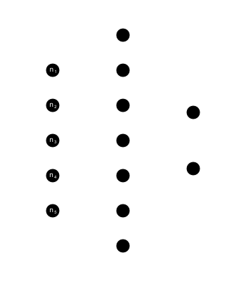

# Solving the Bose Hubbard Model using Machine Learning

This is an implementation of a variational quantum monte carlo technique to solve the Bose Hubbard Model (and possibly its extensions) as explained in [arXiv:1707.09723](https://arxiv.org/abs/1707.09723). 



It utilizes a feed-forward neural network as a variational ansatz for the wavefunction of the system. The ground state wavefunction can be determined by training the network parameters to minimize the expectation value of the hamiltonian (energy). This method can serve as an alternative to exact diagonalization as it reduces the memory required to specify the wavefunction by exploiting any structure in the co-efficients to store it more efficiently (in the form of a neural network).

## Basic usage

### Setting up the neural network:
```
num_bosons, num_lattice_sites = 5, 5
num_hidden_layers = 10

# chain together dense layers to construct a feed-forward neural network
network = Chain(Dense(num_lattice_sites, num_hidden_layers, tanh), Dense(num_hidden_layers, 2)) 

# obtain wavefunction coefficients from the network
psi(n) = exp(sum(network(n) .* [1, 1im]))
```

### Calculate the expectation value of any observable (by monte carlo sampling):

```
expectationMC(psi, op, L, N, basis, network, rtol, atol, window_size; callback, kwargs...)
```

Currently, there is no way to sample the basis set without enumerating it completely first (forcing the requirement of the `basis` argument which is a list of all basis elements). The `generate_basis(N, L)` function can be used for this purpose, where `N` is `num_bosons` and `L` is `num_lattice_sites`.

To determine the convergence of the MC average, we track the last `window_size` values of the sampling. `rtol` and `atol` are required to specify the tolerance of statistical errors in the result.

The operator `op` must be a function that takes in a vector (`state`, an element of the basis set), num_bosons, `N` and num_lattice_sites, `L`. It must return a collection of tuples `(state_final, coefficient)` obtained by the application of the operator on the state. Any parameters required by the operator are passed through the keyword arguments, `kwargs`. 


### Calculate energy gradient

```
Ow_energy(psi, L, N, basis, network, rtol, atol, window_size; callback, kwargs...)
```

Same arguments as discussed in the previous section. However, `kwargs` must specifically contain the parameters required to construct the hamiltonian (since it calculates the *energy* gradient).

### Callback functions

All the MC loops have the provision of calling a callback function every `n` iterations (`n=100` currently). This can be useful if you want to track some other quantity or perform an action periodically while the MC procedure is running. The function must take an input tuple `(expectations, n_iter)` which specifies the state of the simulation at that moment. `expectations` carries the last `window_size` results of the MC sampling and `n_iter` is the iteration number at the moment the callback is invoked.

A `debug_plot_init` function is provided out of the box that plots the MC values in real-time (using `Makie.jl`) as the loop is running which can be useful for debugging the code.